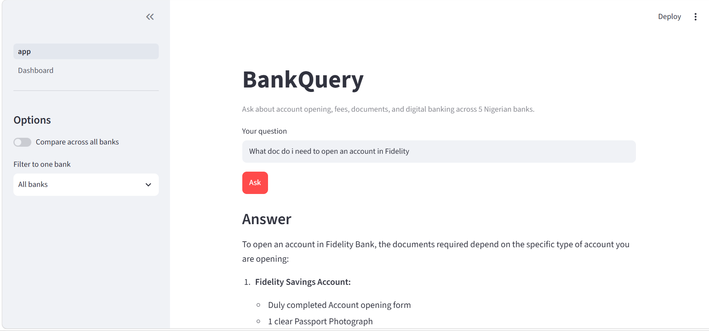
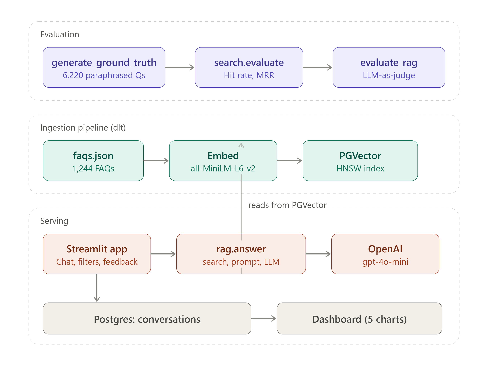
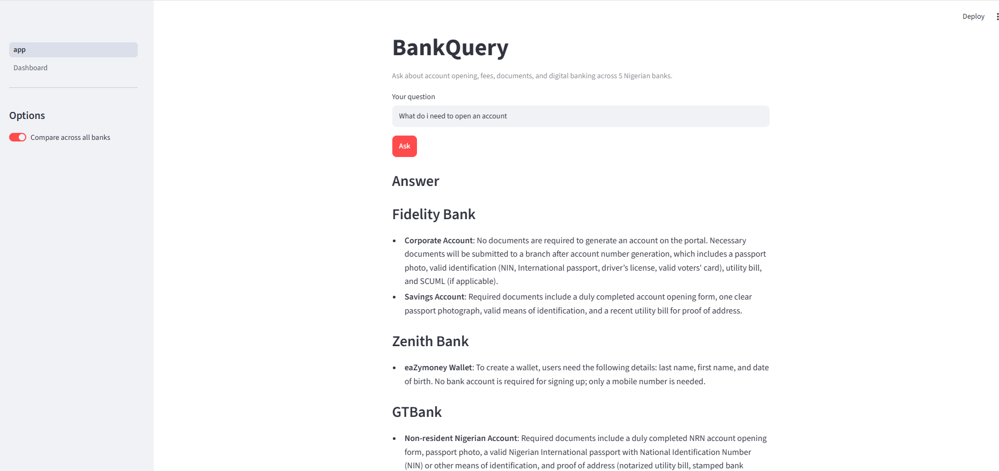
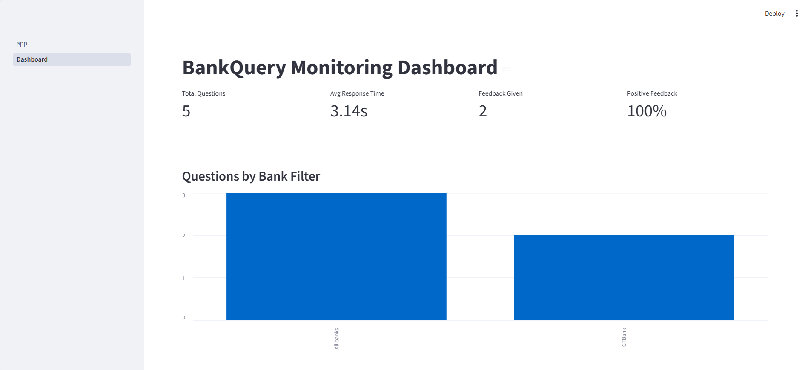

# BankQuery

A RAG-powered assistant that answers customer questions about account
opening, documentation, fees, and digital banking across five major
Nigerian banks — GTBank, Zenith Bank, First Bank, Fidelity Bank, and
UBA — and lets users compare requirements side-by-side.



## Problem

Nigerian bank customers regularly need practical, procedural information
(what documents are needed to open an account, transaction limits, how to
reset internet banking credentials, etc.), but this information is
scattered across dozens of pages per bank, phrased differently by every
bank, and impossible to compare side-by-side. BankQuery lets a customer
ask a plain-language question and get an accurate, sourced answer — or
compare policies across banks in one query.

## Dataset

1,244 real FAQ entries scraped from the public help/FAQ pages of five
Nigerian banks (snapshot date: September 2026):

| Bank | FAQs | Categories |
|---|---|---|
| Fidelity Bank | 228 | 8 |
| Zenith Bank | 295 | 11 |
| GTBank | 55 | 4 |
| First Bank | 329 | ~60 |
| UBA | 337 | 29 |
| **Total** | **1,244** | — |

See `scrapers/README.md` for scraping method notes per bank. GTBank and
UBA required navigating to non-obvious URLs; Zenith Bank required manual
browser copy + parse since the site's Incapsula bot protection blocks
both plain HTTP requests and headless-browser automation (Playwright).

## Architecture



```
data/faqs.json (1,244 FAQs)
        │
        ├── ingest.py                  load & normalize documents
        ├── generate_ground_truth.py   LLM-generated eval questions (6,220)
        │
        ├── search.py                  text search baseline (minsearch)
        ├── vector_search.py           vector search (PGVector + sentence-transformers)
        ├── hybrid_search.py           RRF fusion (evaluated, not used in production)
        ├── query_rewrite.py           query rewriting (evaluated, not used in production)
        ├── rerank.py                  cross-encoder reranking (evaluated, not used in production)
        │
        ├── rag.py                     search → prompt → LLM answer
        ├── evaluate_rag.py            LLM-as-judge answer quality eval
        │
        ├── pipeline.py                dlt-wrapped end-to-end ingestion/embedding/load
        ├── test_pipeline.py           smoke tests
        │
        ├── app.py                     Streamlit interface (chat, filters, feedback)
        └── pages/1_Dashboard.py       monitoring dashboard
```

## Retrieval evaluation

I decided to start with text search,then
measure before adding complexity, and let evaluation data decide when
vector/hybrid search earns its place — I built a 6,220-question ground
truth set (LLM-generated paraphrases of the original FAQs, ~5 per FAQ,
explicitly naming the relevant bank to avoid ambiguity) and evaluated
each retrieval method with Hit Rate and Mean Reciprocal Rank (MRR).

| Method | Hit Rate | MRR |
|---|---|---|
| Text search (no boost) | 0.5685 | 0.4188 |
| Text search (tuned field boosts) | 0.7209 | 0.5503 |
| **Vector search (production)** | **0.9254** | **0.8150** |
| Hybrid search (RRF: text + vector) | 0.9018 | 0.7177 |

**Method:** text search uses `minsearch` (TF-IDF-style keyword matching)
with field boosts grid-searched over `question`, `answer`, and `category`
weights (best: question×3.0, answer×2.0, category×0.5). Vector search
uses `sentence-transformers/all-MiniLM-L6-v2` embeddings (question +
answer concatenated) stored in PGVector (Postgres + pgvector extension)
with an HNSW index for approximate nearest-neighbor search. Hybrid search
combines both via Reciprocal Rank Fusion (RRF, k=60).

**Why vector search was chosen:** analyzing text search's failures
showed a clear, consistent pattern — missed questions shared almost no
literal words with the correct FAQ despite being semantically identical
(e.g. "How much money can I have before I need to upgrade?" vs. "maximum
cumulative balance"). This is exactly the synonym/paraphrase gap vector
embeddings are designed to close, and the evaluation confirmed it: Hit
Rate jumped from 0.72 to 0.93.

**Why hybrid search was evaluated but not used:** RRF fusion is often
assumed to be strictly better than either method alone, but on this
dataset it underperformed pure vector search (Hit Rate 0.90 vs 0.93, MRR
0.72 vs 0.82). Text search's comparatively weak rankings diluted vector
search's much stronger ones during rank fusion. This was evaluated and
documented rather than assumed — vector search alone is used in
production.

## RAG pipeline & answer evaluation

The winning retrieval method (vector search, top-5) is wired into a RAG
pipeline (`rag.py`): retrieve → build prompt with bank-attributed context
→ generate answer with `gpt-4o-mini`. Answer quality was evaluated with
an LLM-as-judge (`evaluate_rag.py`) on a 200-question sample from ground
truth, comparing each generated answer against the original FAQ answer.

**Result: 76.0% good** (152/200), 0 errors.

### Iteration and findings

The first evaluation pass scored 73.5%. Reviewing the "bad" verdicts
revealed most failures were **cross-bank contamination**: since the
initial ground truth questions didn't name a specific bank, retrieval
correctly returned similar FAQs from multiple banks, but the LLM
sometimes blended facts across them (e.g. stating one bank's fee applies
generally). An attempt to fix this by forcing single-source answers
*worsened* results to 63–71%, because it caused the LLM to sometimes lock
onto the wrong bank's answer for inherently bank-specific questions
(e.g. Internet Banking fees genuinely differ by bank).

The actual fix: regenerating ground truth so each question naturally
names its bank (removing the ambiguity at the source, since the
underlying facts genuinely differ across banks) improved answer quality
to 76.0% — confirming ground-truth ambiguity, not the RAG system itself,
was the larger cause of the earlier "bad" verdicts.

**Remaining failure analysis** (24%, from the bank-aware evaluation):

- **Retrieval misses** — a handful of questions the RAG system couldn't
  answer despite the answer existing in the data, meaning vector search
  missed it for that specific phrasing (overall Hit Rate is 93%, so this
  is an edge case, not systemic).
- **Detail omission** — the correct FAQ was retrieved, but the LLM
  summarized away specific figures (e.g. a stated ratio or numeric limit)
  even when instructed not to.
- **Rare misreading** — in a few cases the LLM stated the opposite of
  what the source text said.

This is treated as an honest, expected failure rate for a RAG system
rather than something to keep prompt-engineering away — the evaluation
process (build ground truth → measure → diagnose failures → fix what's
fixable → document what's left) is the deliverable here, not a
maximized score.

## Best practices evaluated

Three standard retrieval-improvement techniques were implemented and
evaluated on a 300-question sample against production vector search.
**None outperformed plain vector search**, and none are used in
production — but all three were measured, not assumed, which is the
point of this exercise.

| Technique | Hit Rate | MRR | Adopted? |
|---|---|---|---|
| Vector search (baseline) | 0.8367 | 0.7089 | ✅ Production |
| Hybrid search (RRF) | 0.9018* | 0.7177* | ❌ Underperformed on full set |
| Query rewriting (LLM expands vague queries pre-search) | 0.8200 | 0.6972 | ❌ Added noise/latency, no gain |
| Reranking (cross-encoder over top-10) | 0.8167 | 0.6528 | ❌ Underperformed |

*(hybrid numbers from the full 6,220-question eval; others from the
300-question sample — noted for consistency)*

**Why these didn't help:** `all-MiniLM-L6-v2` embeddings already perform
strongly on short, well-formed FAQ-style text, leaving limited room for
a general-purpose reranker (trained on web/passage-ranking data, not
banking FAQs) to improve on it — and it sometimes demoted correct short
answers in favor of longer ones that superficially looked more relevant.
Query rewriting mainly helps on vague, fragment-style input; our ground
truth questions are already clear, specific, bank-named paraphrases, so
rewriting added drift rather than clarity.

## Interface

Built with Streamlit (`app.py`): a chat-style question box, a bank
filter dropdown, and a comparison-mode toggle that retrieves per-bank
(rather than top-k globally) so no single bank dominates the answer.
Every answer shows its sources and 👍/👎 feedback buttons.



## Monitoring

Every conversation (question, answer, bank filter, number of sources,
response time, feedback) is logged to a Postgres `conversations` table.
A separate Streamlit page (`pages/1_Dashboard.py`) provides a live
monitoring dashboard with 5 charts: questions by bank filter, feedback
over time, response time distribution, questions over time, and sources
retrieved per query — plus top-line metrics and a recent-conversations
table.



## Automation

`pipeline.py` wraps the full ingestion flow — load FAQ data, track it as
a versioned dlt resource (DuckDB staging layer), embed with
sentence-transformers, load into PGVector with an HNSW index, and ensure
the `conversations` table exists — into one re-runnable script
(`python pipeline.py`). `test_pipeline.py` provides smoke tests
confirming documents load correctly, both search methods return
well-formed results, bank filtering works, and `evaluate()` runs
end-to-end.

## Containerization

The full stack (Streamlit app + Postgres/PGVector) runs via Docker
Compose. Notable build fix: `sentence-transformers` pulls in `torch`,
which by default installs full CUDA/GPU support (~2GB+ of unnecessary
Nvidia packages) — the Dockerfile installs a CPU-only torch build first
to avoid this.

## Setup

### Local (without Docker)

```bash
uv sync
cp .env.example .env   # fill in OPENAI_API_KEY and DATABASE_URL

docker run -d \
    --name bankquery-pgvector \
    -e POSTGRES_USER=user \
    -e POSTGRES_PASSWORD=pswd \
    -e POSTGRES_DB=bankquery \
    -v bankquery_pgvector_data:/var/lib/postgresql/data \
    -p 5432:5432 \
    pgvector/pgvector:pg17

uv run python pipeline.py       # embeds + loads all 1,244 FAQs, creates tables
uv run python test_pipeline.py  # smoke tests
uv run streamlit run app.py
```

### Docker Compose (full stack)

```bash
cp .env.example .env   # fill in OPENAI_API_KEY

docker compose up --build -d
docker compose exec app python pipeline.py   # populate PGVector (first run only)
```

Open `http://localhost:8501`.
Live : 
